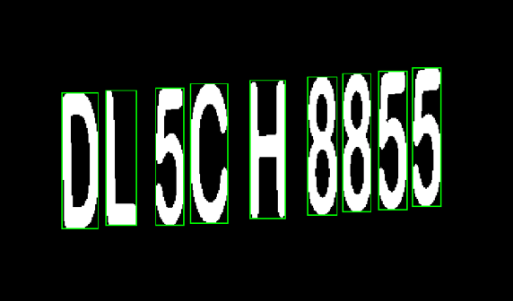

# 🚗 License Plate Image Processing & Recognition

A computer vision project focused on processing vehicle images, detecting license plates, and recognizing the numbers and characters contained in the plate.

---

## 📌 Overview

This project focuses on using image processing and computer vision techniques to detect and process vehicle license plates and extract their readable information.

The project covers two main stages:

1. License plate image processing and detection
2. License plate number and character recognition

The main purpose of the project was to explore how visual information from a vehicle image can be processed and converted into meaningful textual information.

---

## 🎯 Objectives

The main objectives of this project were:

- Processing vehicle images
- Detecting the license plate region
- Extracting the license plate from the original image
- Applying image processing techniques to improve the plate image
- Processing the characters and numbers on the license plate
- Recognizing the information contained in the plate
- Exploring the challenges of license plate detection and recognition

---

## 🔄 General Workflow

The overall workflow of the project can be represented as:

```text
Vehicle Image
      │
      ▼
Image Preprocessing
      │
      ▼
License Plate Detection
      │
      ▼
Plate Region Extraction
      │
      ▼
Image Processing
      │
      ▼
Character / Number Recognition
      │
      ▼
Recognized License Plate
```
## 🖼️ Image Processing

The first part of the project focuses on processing the input vehicle image and locating the license plate.

Image processing techniques can be used to improve the quality of the input image and make the license plate easier to detect and analyze.

The general process includes:

```text
Input Image
     ↓
Preprocessing
     ↓
License Plate Detection
     ↓
Plate Extraction
     ↓
Processed Plate
```

The processed license plate can then be passed to the recognition stage.

---

## 🔎 License Plate Detection

The detection stage attempts to identify the location of the license plate within a vehicle image.

Once the plate is detected, its region can be extracted from the original image.

Example:

```text
Original Vehicle Image
          │
          ▼
   Plate Detection
          │
          ▼
 ┌─────────────────┐
 │ License Plate   │
 └─────────────────┘
```

The detected region becomes the input for the next stage of the system.

---

## 🔤 License Plate Recognition

After extracting the license plate, the next stage focuses on recognizing the characters and numbers contained in the plate.

The general process can be represented as:

```text
Extracted Plate
      │
      ▼
Image Preprocessing
      │
      ▼
Character Processing
      │
      ▼
Character Recognition
      │
      ▼
License Plate Number
```

The goal is to transform visual information into readable text.

---

## 🧠 Concepts

This project explores concepts related to:

- Computer Vision
- Digital Image Processing
- Image Preprocessing
- Object / Region Detection
- Region of Interest (ROI)
- Character Recognition
- Optical Character Recognition (OCR)
- License Plate Recognition

---

## 🛠️ Technologies

The project is related to the following technologies and concepts:

- MATLAB
- Image Processing
- OCR / Character Recognition

---

## 📷 Results

The project can be documented using input and output images showing the different stages of processing.

A typical result can be presented as:

```text
Original Image
      ↓
Detected License Plate
      ↓
Processed Plate
      ↓
Recognized Characters
```
One of the outputs:

<p align="center">
  
</p>

---

## 📚 What I Learned

Through this project, I explored:

- How digital images can be processed programmatically
- How a specific region can be detected inside an image
- How image preprocessing affects recognition
- How license plate images can be extracted from vehicle images
- The challenges involved in character recognition
- The general workflow of a computer vision recognition system
- The relationship between image processing and OCR

---

## ⚠️ Challenges

License plate detection and recognition can be affected by several factors, including:

- Image quality
- Lighting conditions
- Viewing angle
- Distance from the vehicle
- Plate orientation
- Background complexity
- Character appearance

These factors can make the detection and recognition process more challenging.

---

## 📌 Project Status

**Status:** Completed / Academic Project

